# Logica — Block Puzzle


A Kotlin Multiplatform super-app for Android and iOS: one lightweight host,
one catalog, and short local-first game sessions. The production bundle
currently includes Block Blast and 2048; additional games and apps are
independent Gradle modules reviewed and allowlisted at build time.


## Download

<a href="https://apps.apple.com/us/app/logica-block-puzzle-2027/id6765924581">
  
</a>

<a href="https://play.google.com/store/apps/details?id=ge.yet.blokblast">
  
</a>

## Screenshots

### iPhone

<p>
  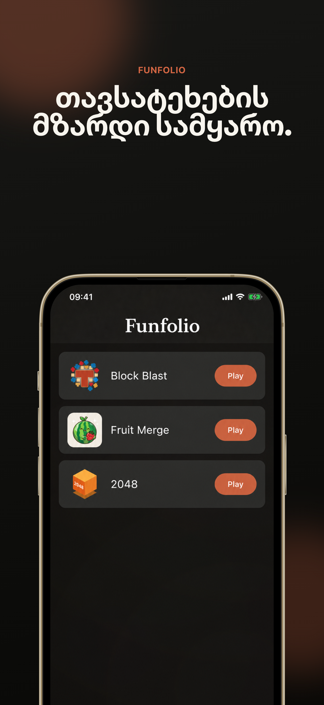
  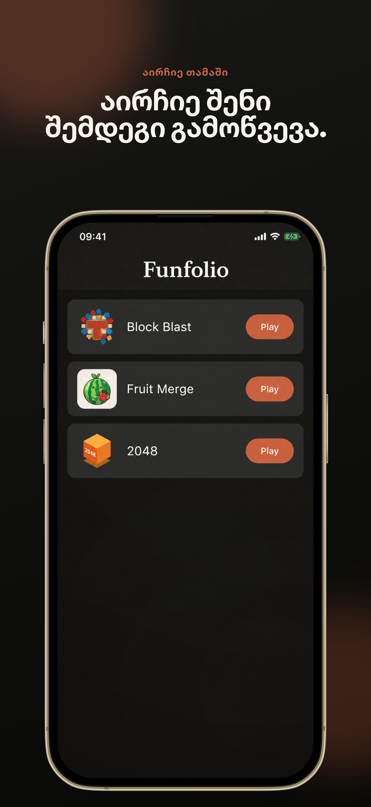
  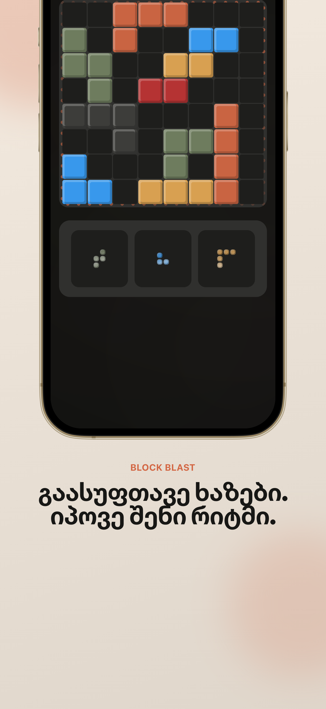
  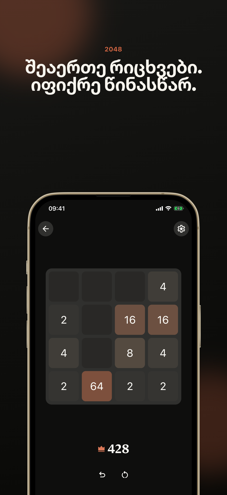
  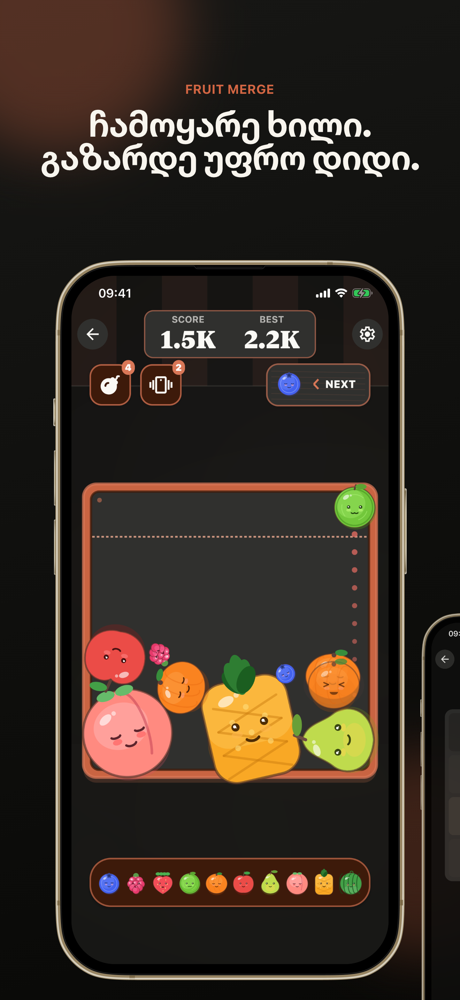
  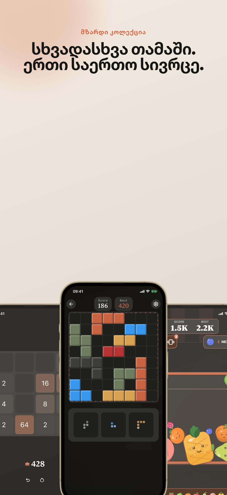
  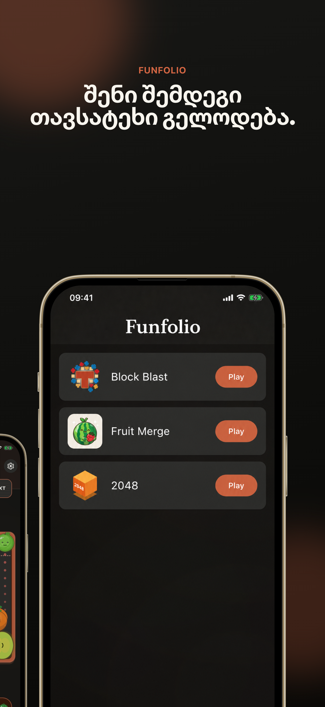
</p>

### iPad

<p>
  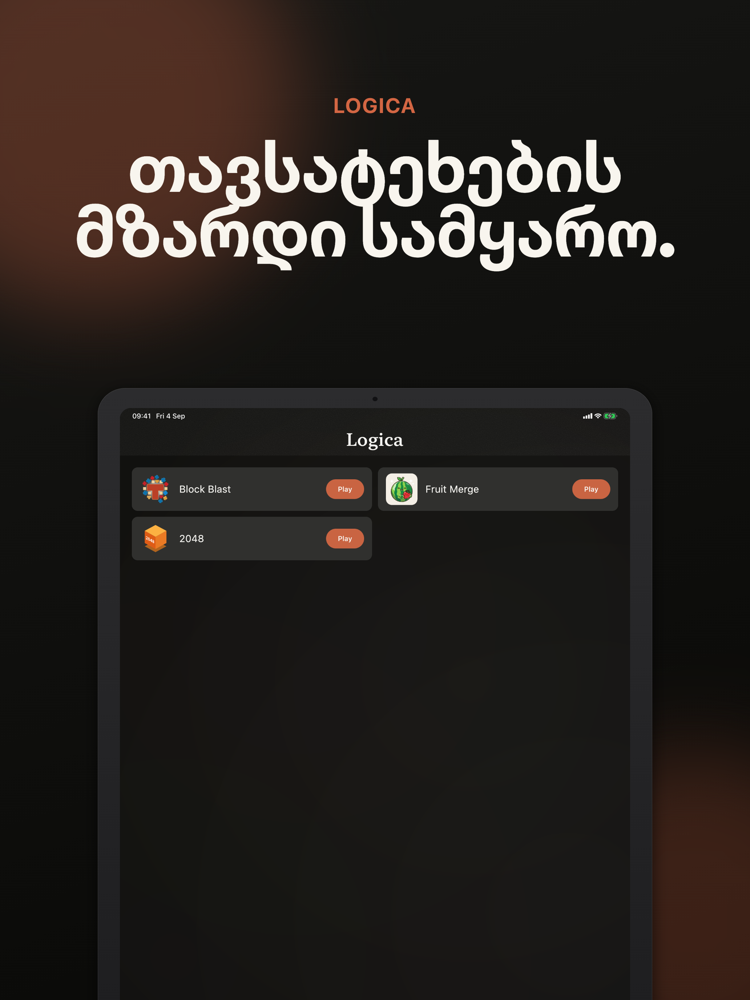
  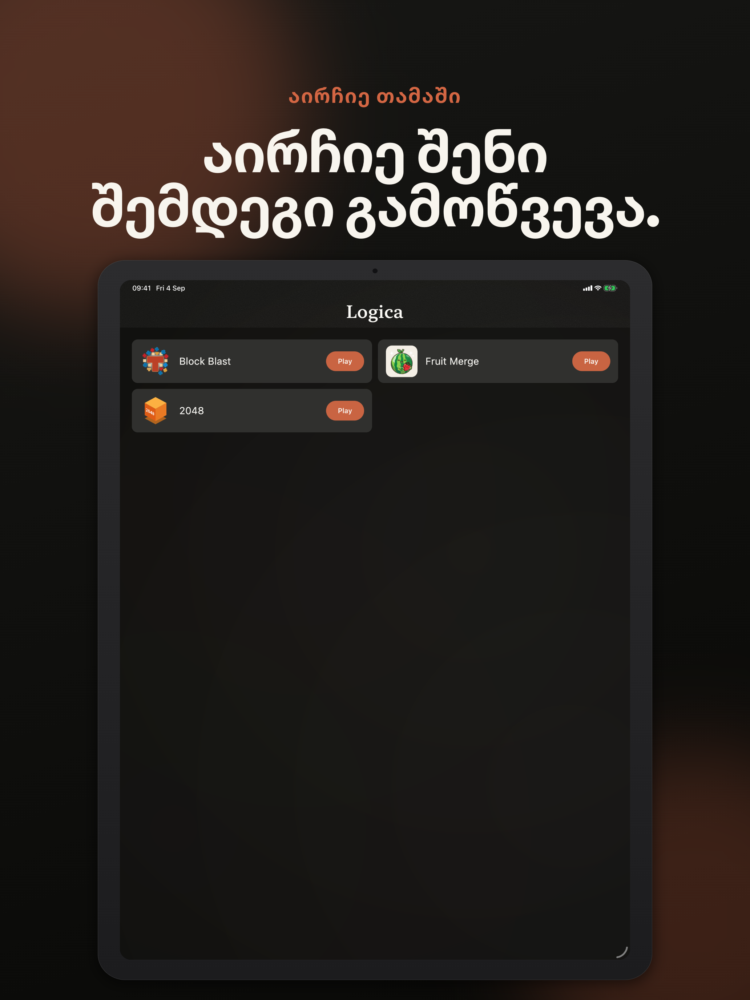
  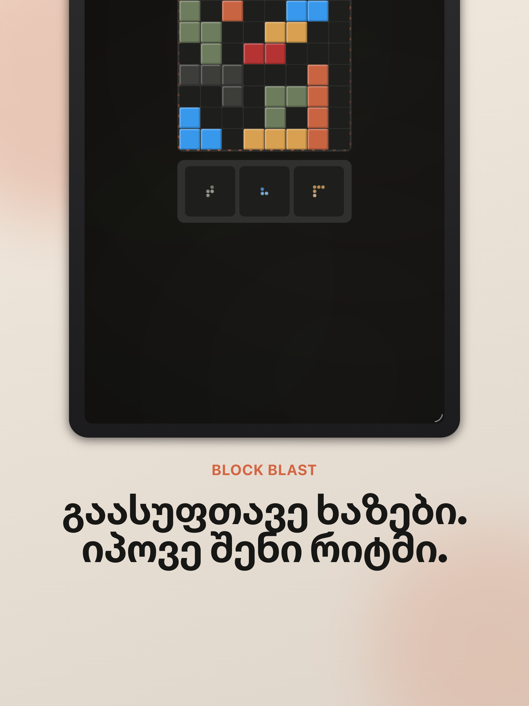
  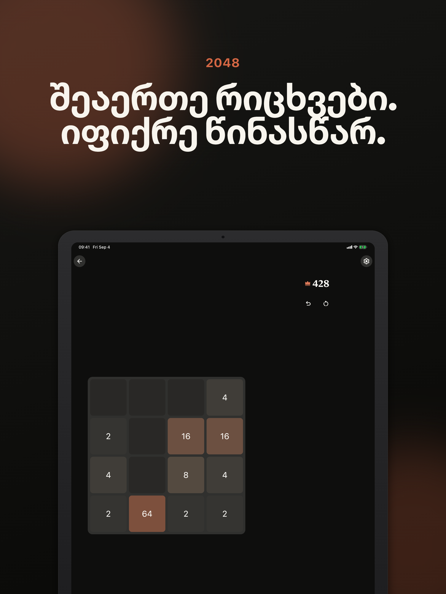
  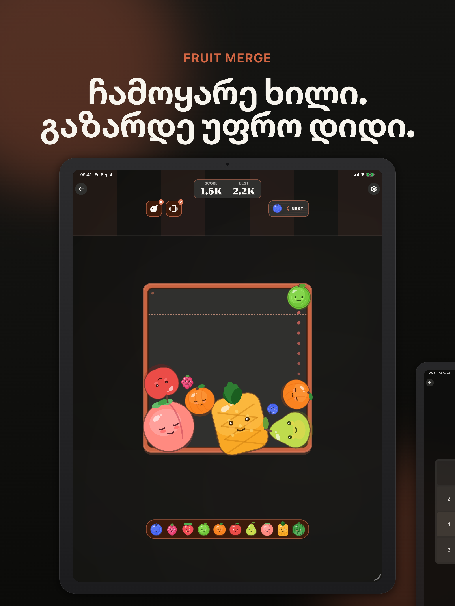
  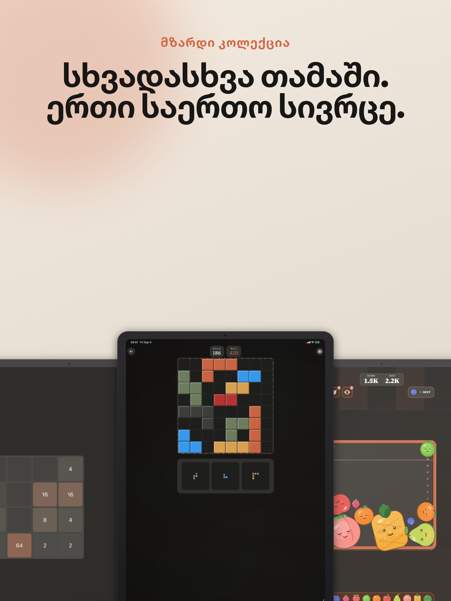
  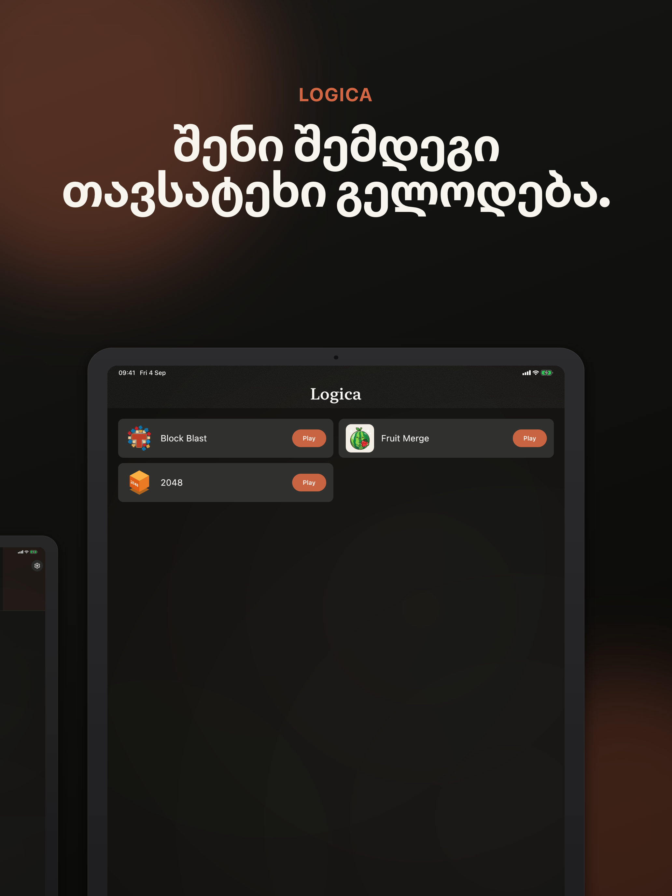
</p>

The screenshot editor contains marketing copy for all 34 application locales
supported by at least one target store. Tajik, Turkmen, and Uzbek remain
available in the app UI but are excluded because neither store supports them.
The README displays the Georgian gallery. English baseline exports remain in
Git for visual regression; all complete store-size bundles are generated on
demand by the manual **Store screenshots** GitHub Actions workflow and retained
as artifacts for 14 days.

### Store listing automation

From `main`, this command generates all 34 localized screenshot sets and then
uploads the fixed `Logica — Block Puzzle` title and localized super-app listing
to both stores. Google Play receives 34 metadata packages, seven phone
screenshots per locale, and 34 feature graphics. App Store Connect receives 28
metadata packages plus seven iPhone and seven iPad screenshots per locale:

```bash
gh workflow run store-screenshots.yml -f locale=all
```

Both edits remain pending for manual review. Google Play uses
`changes_not_sent_for_review: true`; App Store Connect uploads metadata and
screenshots with binary upload, review submission, and automatic release
disabled. A specific locale, for example `locale=ka`, only generates a
downloadable artifact and never publishes a partial listing. Before an
all-locale run, `MARKETING_VERSION` in
`iosApp/Configuration/Config.xcconfig` must identify the next editable App Store
version.

Listing publication requires the Google service-account JSON and an App Store
Connect team API key:

```bash
gh secret set PLAY_STORE_JSON_KEY < /path/to/play-store-service-account.json
base64 < /path/to/AuthKey_KEYID.p8 | gh secret set APP_STORE_CONNECT_KEY_CONTENT
gh secret set APP_STORE_CONNECT_KEY_ID
gh secret set APP_STORE_CONNECT_ISSUER_ID
```

Allow approximately 20–45 minutes for a complete cold generation and both draft
uploads. The Play and App Store publication jobs run independently after the
shared render matrix. The workflow records actual render durations in its
Actions summary.

### Signed iOS release CI

A pushed `vX.Y.Z` tag starts Android and iOS release jobs independently. The
iOS job builds an App Store-signed IPA using version `X.Y.Z` and the GitHub run
number, uploads it to App Store Connect/TestFlight, and retains the IPA and dSYM
for 14 days. It does not distribute the build to testers, select it for an App
Store version, submit it for review, or release it.

Configure these additional repository secrets before the first tag run:

```bash
base64 < /path/to/distribution.p12 | gh secret set IOS_DIST_CERT_P12
gh secret set IOS_DIST_CERT_PASSWORD
base64 < /path/to/app-store.mobileprovision | gh secret set IOS_PROVISIONING_PROFILE
gh secret set IOS_PROVISIONING_PROFILE_NAME
base64 < iosApp/iosApp/GoogleService-Info.plist | gh secret set GOOGLE_SERVICE_INFO_PLIST
```

The certificate must be an Apple Distribution certificate and the provisioning
profile must target `ge.yet3.blokblast.BlockBlast` for team `3KKQ642Q9H`.
The temporary CI keychain uses a per-run random password and needs no repository
secret.

## Features

- 🧩 Classic block-puzzle gameplay with smooth animations
- 🎨 Polished Material 3 UI tuned for the Block Blast feel
- 📱 Single codebase for Android & iOS via Compose Multiplatform
- 💾 Persistent settings and best-score tracking
- 🎉 Confetti effects on big clears
- 🎵 Rotating background music across multiple tracks
- 📴 Fully offline — no account required
- ⭐ In-app review prompts on Android
- 📊 Firebase Analytics & Crashlytics
- 🧱 Compile-time MiniApp plugin framework with a uniform catalog and host frame
- 🔌 Contributor games discovered locally and shipped only through reviewable allowlisting

The catalog is intentionally compact: cards show the game icon, title and Play
action. Full descriptions remain in each `MiniAppManifest` for metadata,
accessibility and future detail surfaces, but are not repeated in the launcher.

## Tech Stack

- **Kotlin Multiplatform** 2.4.10 — shared business logic
- **Compose Multiplatform** 1.11.1 — declarative UI for Android & iOS
- **Material 3** — design system
- **Decompose** + **Essenty** — navigation & lifecycle
- **MVIKotlin** — predictable state management (MVI)
- **Metro DI** — compile-time dependency injection
- **Kotlinx Coroutines / Serialization / Datetime**
- **Multiplatform Settings** — cross-platform key/value storage
- **Firebase** (GitLive SDK) — Analytics, Crashlytics
- **Google Mobile Ads** + **User Messaging Platform** (Android)
- **ConfettiKit** — celebratory effects
- **Baseline Profiles** — Android startup performance

## Project Structure

```
BlockBlast/
├── androidApp/      # Android entry point (Activity, manifest, ads, Firebase)
├── iosApp/          # iOS entry point (SwiftUI host)
├── composeApp/      # Shared host UI, MiniApp frame and platform composition
├── core/
│   ├── common/      # Shared utilities
│   ├── domain/      # Reusable domain contracts
│   ├── data/        # Settings and shared repositories
│   └── telemetry/   # Analytics and crash facade
├── feature/
│   ├── catalog/     # Registry-backed MiniApp catalog
│   ├── root/        # Catalog/running navigation and host lifecycle
│   ├── review/      # App review policy
│   └── settings/    # Host settings
├── game/
│   ├── blockblast/       # Allowlisted Block Blast MiniApp
│   └── twentyfortyeight/ # Allowlisted 2048 MiniApp
├── miniapp/
│   ├── api/         # Stable Compose-free contracts
│   ├── compose/     # Plugin, manifest, session and frame contracts
│   ├── metro/       # Registry and retained child-graph foundation
│   ├── storage/     # Namespaced persistence and safe all-game-data reset
│   ├── audio/       # Portable procedural Music/SFX API and runtime
│   ├── audio-presets/ # Original reusable instruments, soundscapes and SFX
│   ├── bundle/      # Production allowlisted plugins
│   ├── testkit/     # Contributor contract fixtures
│   └── samples/     # Discovered but unshipped examples
├── build-logic/     # MiniApp discovery, scaffold and convention plugins
└── fastlane/        # Store metadata & changelogs
```

## Getting Started

### Prerequisites
- **JDK 17+**
- **Android Studio** Ladybug or later
- **Xcode 15+** (iOS, macOS only)
- Your own Firebase project — see below

### Firebase setup

This repo does **not** ship Firebase config files. Create your own Firebase project and drop in:

- `androidApp/google-services.json`
- `iosApp/iosApp/GoogleService-Info.plist`

### Build and Run

#### Android

```bash
./gradlew :androidApp:assembleDebug
./gradlew :androidApp:installDebug
```

#### iOS

Open `iosApp/iosApp.xcodeproj` in Xcode and run.

## Development

### Tests

```bash
./gradlew test
```

### Create a game / MiniApp

If you are a human contributor or an AI agent and the request is to create,
add or port a game, start with the official scaffold workflow below. Do not
create an arbitrary Gradle module and do not add the game to the production
allowlist automatically.

```bash
./gradlew createMiniApp -PminiAppId=game.snake -PminiAppName=Snake
./gradlew :game:snake:verifyMiniApp
```

For a game-oriented starting point with immutable state, typed actions, a pure
engine seam and focused component tests, add `-PminiAppProfile=game` to the
first command. The default profile is intentionally smaller and keeps the
existing basic scaffold behavior.

The first command creates reviewable source. The next Gradle invocation
discovers `game/*` and `miniapp/samples/*`, but discovery does not ship a
plugin. `verifyMiniApp` checks the module boundary, tests and Android/iOS
compilation. After review, a maintainer adds exactly one matching entry to the
root `miniApps` allowlist. The catalog is compiled into the app; there is no
server, runtime download or remote code loading.

The stable policy and rationale are recorded in
[ADR-0001: MiniApp Contribution and Shipping Workflow](docs/adr/0001-miniapp-contribution-and-shipping.md).
Use the [human MiniApp contributor guide](CONTRIBUTING_MINIAPP.md) for the
end-to-end workflow and the [AI contributor protocol](docs/miniapp/AI_CONTRIBUTOR_PROTOCOL.md)
for deterministic agent behavior. The current agent-level architecture and
verification rules are in [AGENTS.md](AGENTS.md). The guides implement the
approved [contributor pipeline design](docs/superpowers/specs/2026-08-23-miniapp-contributor-pipeline-design.md).

Plugins depend only on MiniApp contracts, approved inward core contracts and
typed host capabilities. Root owns Catalog/Running navigation, Back,
Settings/Review, visibility and stale-callback protection. The common frame
owns catalog cards, toolbar controls and ad containers; Replay is intentionally
not part of the initial plugin API.

### Asset and icon timing

Do not spend the beginning of a MiniApp implementation on its product or game
icon. Build and review rules, persistence, lifecycle, compact/wide UI,
accessibility and CI first. Add the final icon only after that surface is
stable. The approved workflow is to write an icon brief, generate/review an
SVG with [QuiverAI](https://app.quiver.ai/), and convert the approved SVG with
[Valkyrie](https://github.com/ComposeGears/Valkyrie) to Compose/Android vector
resources. A Gemini Flash-class model may assist a bounded SVG-to-Android-XML
conversion, but the result still requires human review, Valkyrie validation
and provenance. Record the source, license, tool/version, brief, date and hash
in the MiniApp provenance file. Experimental open SVG models are research
inputs, not build or runtime dependencies; evaluate their license and
reproducibility before adopting one.

For a broader, evidence-based review of the super-app architecture and CI,
use the [architecture audit agent prompt](docs/miniapp/super-app-architecture-audit-agent.md).

Use the session-bound `MiniAppStorage` from `MiniAppSessionContext` for new
persistence. Games supply only local snake-case names; the host owns physical
namespacing, snapshot migrations, legacy aliases and the safe all-game-data
reset. MiniApp modules must not depend on Multiplatform Settings directly.
Block Blast's legacy physical keys remain unchanged for save compatibility.

### Create procedural music and SFX

MiniApps can declare original, asset-free Music and SFX in shared Kotlin for
Android and iOS. Start with the
[procedural audio getting-started guide](docs/miniapp/audio/getting-started.md),
then use the [Kotlin DSL reference](docs/miniapp/audio/kotlin-dsl.md),
[shared presets](docs/miniapp/audio/instruments.md), and
[mobile budgets](docs/miniapp/audio/performance-budgets.md).

AI agents must use the repo-local
[MiniApp procedural audio skill](.agents/skills/miniapp-procedural-audio/SKILL.md).
It prioritizes preset reuse, original declarations, deterministic seeds,
session lifecycle correctness and compiled examples. Engine maintainers should
read the approved
[architecture design](docs/superpowers/specs/2026-08-23-kotlin-pattern-audio-design.md)
and [implementation plan](docs/superpowers/plans/2026-08-23-miniapp-procedural-audio.md);
MiniApp authors must not depend on internal DSP or platform sinks.

Block Blast deliberately keeps its original bundled MP3 music and voice clips
through the app-owned legacy `AudioRepository`. This is not a reusable MiniApp
capability or a contributor pattern; new MiniApps use the procedural API unless
a separate architecture decision introduces a general asset-audio contract.

## Contributing

Contributions are welcome. MiniApps generated by the command above remain
unshipped until their source, dependency boundary and allowlist change are
reviewed.

## Support Me

- **Support:** [ryaeh7282@gmail.com](mailto:ryaeh7282@gmail.com)
- **ton**: UQCi1XMdZP2fBfTK-O6rsAX3fXEm5iBpjO1D6FDekdUDQnaw
- **btc**: bc1qv2m03vg23227yfnlu0c0jx2ps5yg8v8kvy748s
- **eth**: 0xdF196759E996Fe684c33416282F30d6B9A0b325e
- **usdt(erc20)**: 0xdF196759E996Fe684c33416282F30d6B9A0b325e
- **bnb**: 0xdF196759E996Fe684c33416282F30d6B9A0b325e
- **usdt(trc20)**: TYrBMc4yN4k8im2Qq2G17hv9VdmcYFngpT

## License

This project is open source and available under the MIT License.

## Learn More

- [Kotlin Multiplatform](https://www.jetbrains.com/kotlin-multiplatform/)
- [Compose Multiplatform](https://www.jetbrains.com/lp/compose-multiplatform/)
- [MVIKotlin](https://github.com/arkivanov/MVIKotlin)
- [Decompose](https://github.com/arkivanov/Decompose)
- [Metro](https://github.com/ZacSweers/metro)
