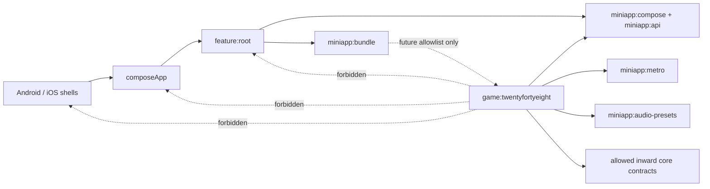
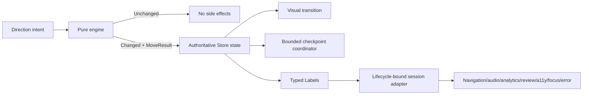
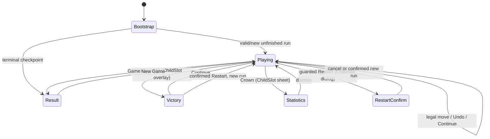

# 2048 MiniApp Design

## 1. Status and date

- **Status:** Revised after architectural review; implementation is not started.
- **Date:** 2026-08-24.
- **Confidence:** High for product, engine, MiniApp integration, persistence, and test boundaries; moderate for final audio mix and motion constants until they are measured on Android and iOS hardware.
- **Decision scope:** architecture and product design only. This document does not authorize scaffolding, source creation, dependency changes, production allowlisting, or shipping.

## 2. Context

Funfolio needs a polished, independently authored version of the familiar 4×4 number-combination game commonly called **2048**. It must be a normal repository MiniApp: discovered by the settings plugin after a future scaffold, hosted by Root, retained through the existing Metro/Decompose session contract, stored only in its MiniApp namespace, and absent from the production bundle until a maintainer separately approves it.

The proposed identity is valid against the current build logic:

| Item | Decision | Validation against current source |
|---|---|---|
| Public name | `2048` | Display names may contain digits. |
| MiniApp ID | `game.twentyfortyeight` | Matches `^[a-z][a-z0-9]*(?:\.[a-z][a-z0-9]*)+$`. |
| Gradle project | `:game:twentyfortyeight` | Matches the direct `:game:<lower-alphanumeric>` rule and the scaffold default derived from the last ID segment. |
| Kotlin package | `ge.yet.game.twentyfortyeight` | This is the package currently rendered from the full ID. |
| Generated Metro factory name | `createGameTwentyfortyeightSessionGraph` | This exact capitalization follows the scaffold renderer and must remain collision-safe. |

The future project is discoverable but unshipped. Discovery is not production authorization; only the root `miniApps` allowlist can put it in `:miniapp:bundle`.

## 3. Approved product decisions

These decisions are the baseline submitted for approval with this document:

- One classic 4×4 board, viewport-wide swipe input, score, monotonic best score, one-step Undo, guarded Restart, incomplete-game restore, first-2048 victory, Continue, values above 2048, game over, statistics, and a first-run overlay.
- A pure deterministic engine with injected RNG state; MVIKotlin owns asynchronous orchestration; Decompose owns internal navigation and modal ownership; Compose only renders immutable models and forwards intents.
- The first direction entered while a visual move transition is active is retained in a one-slot pending queue. Further directions are ignored until the matching animation completes; persistence latency never extends that input gate.
- Victory is a modal state over the live Playing child. Game Over is a separate Result child. Both Playing and Result use `MiniAppFrameMode.Standard`, retaining host Back, Settings, safe-area, and banner ownership.
- Toolbar, system, and predictive Back all enter Root's single Back path. Root first invokes the active session's optional `handleBack(): Boolean`; 2048 consumes it only to dismiss Victory, Statistics, or Restart confirmation, while the safe default `false` preserves host-owned exit for Block Blast, Counter, Playing without an overlay, Result, and unavailable content.
- Undo state is persisted. It is small, deterministic, and required for an honest restore.
- Best/Crown opens a game-owned statistics sheet. Result also shows a compact statistics subset.
- The visual direction is warm editorial, not a replica of any existing 2048 product. Music is an original warm evolving synth score.
- No game-owned ads, interstitial, paywall, revive, or haptics. Haptics remain absent because the public MiniApp context exposes no such capability.

## 4. Goals

- Make every legal rule and side effect deterministic and independently testable.
- Preserve the exact unfinished game, RNG continuation, and one-step Undo across process loss.
- Provide a responsive, accessible, localized Compose UI across compact, medium, expanded, compact-height, split-screen, and live-resize environments.
- Give animation, audio, analytics, persistence, and accessibility consumers one typed authoritative transition rather than independently inferring facts from board diffs.
- Use the existing MiniApp, storage, audio, review, telemetry, retention, and reset contracts without outward dependencies.
- Keep input, persistence, audio, and animation bounded and lifecycle-owned.

## 5. Non-goals

This design excludes alternate board sizes, modes, timers, Zen mode, challenges, achievements, accounts, cloud sync, multiplayer, leaderboards, consumable revive, paywalls, game-owned ads, deep links, catalog context menus, and a new screenshot framework. It also excludes a generic puzzle engine, a generic statistics host route, a tutorial setting in host Settings, and runtime use of Klang, Strudel, MP3, or third-party audio engines.

## 6. Rights and provenance

The mechanics are implemented from first principles as mathematical rules. No original or third-party 2048 code, layouts, color tables, tile assets, transition constants, screenshots, or implementation text may be copied. UI composition, palette, catalog art, procedural declarations, note material, rhythm, arrangement, seeds, and SFX are original Funfolio work.

The following Klang pages from the product brief are mood references only: they communicate a broad evolving-synth vocabulary. They are not transcription sources.

- [Synthasy 7 Prelude](https://klang.finzo.de/song/code/builtin-song-final-synthasy-7-prelude)
- [Stranger Synths](https://klang.finzo.de/song/code/builtin-song-stranger-synths)
- [Synthkura](https://klang.finzo.de/song/code/builtin-song-synthkura)
- [Der Schmetterling](https://klang.finzo.de/song/code/builtin-song-der-schmetterling)

The future source provenance record must explicitly say that their code, notes, melodies, rhythms, sections, seeds, parameter sets, and recognizable motifs were not used.

Before any scaffold or implementation, the contributor/maintainer must complete ADR-0001's rights classification and provenance package. This design classifies the proposal as familiar mechanics plus independent expression, which normally follows the clean-room contribution path rather than the existing/licensed-IP path. If the maintainer instead classifies the public name, submitted assets, or later references as existing/licensed IP, an approved proposal issue becomes a prerequisite; this document does not create that issue.

## 7. Module boundaries

`:game:twentyfortyeight` owns all game-specific behavior and expression:

- board, tile value, direction, legal-move, line reduction, score, victory, game-over, RNG, spawn, Undo, and statistics models;
- snapshot schemas and game-specific persistence coordinator;
- MVIKotlin Stores and event mapping;
- internal Decompose navigation, overlays, and session component;
- Metro child graph, concrete retained session binding, plugin, and manifest;
- Compose board, tile, controls, tutorial, statistics, result, adaptive policy, and gesture detector;
- immutable procedural-audio program, typed control/SFX names, and command adapter;
- resources and game-specific tests.

The module must not depend on a feature, `composeApp`, a native app, raw Multiplatform Settings, `AudioRepository`, Firebase SDK, advertising SDK, native navigation, native audio/haptic APIs, or a MiniApp host implementation. Engine packages have no knowledge of Compose, coroutines, MVIKotlin, Decompose, Metro, storage, audio, analytics, wall-clock time, or platforms.

Host ownership remains unchanged for Back dispatch and final session exit, Settings, common toolbar, safe areas, banner, review policy, lifecycle/visibility, audio suppression and teardown, catalog cards, reset orchestration, and production allowlisting. A session may synchronously consume Back through the generic optional `MiniAppSession.handleBack()` contract before Root performs its normal exit; Root never learns a game-specific navigation type.

## 8. Dependency direction



The future module applies only `funfolio.miniapp`. The convention supplies the approved contract, Metro, Compose resource, and audio-preset edges. Any additional dependency needs separate architectural justification and is outside this design.

No engine is extracted to `core`: there is no second demonstrated rules consumer. Pure code is not automatically shared code.

## 9. Pure engine

The engine API is an internal, referentially transparent reducer over explicit input:

```text
applyMove(GameState, Direction) -> MoveResult
newGame(RngState) -> NewGameResult
undo(GameState, UndoSnapshot) -> UndoResult
legalDirections(Board) -> Set<Direction>
```

`Board` is a fixed 16-cell row-major value object. `TileValue` is a positive power-of-two `Long`; empty cells are absent values. Merges use checked doubling. `2^62` is the largest representable tile: two such tiles are not considered mergeable, preventing silent overflow while supporting every practical value above 2048. Score is a non-negative checked `Long`.

Runtime `TileId` is a domain transition identity, not persisted content. Existing non-merged tiles retain IDs during one session, a merge receives one new ID, and a spawn receives one new ID. Restore deterministically assigns fresh IDs in row-major order because no animation spans process destruction. Persisted Undo likewise stores values, not presentation identities; an Undo transition constructs a new explicit visual mapping.

Undo returns a closed `UndoResult`: `Unavailable`, or `Changed` with the restored
state and a typed `UndoTransition`. When the accepted move's session-only runtime
lineage is still available and matches the authoritative board, Undo returns
`Reverse(beforeBoard, restoredBoard, motions)`. Process restore persists no
runtime IDs or visual lineage, so the same domain Undo snapshot returns
`Crossfade(beforeBoard, restoredBoard)`. The fallback is typed; the UI never
infers it from missing IDs or board-value equality.

`MoveInput` and `GameState` require `nextTileId` to exceed every ID on the board.
Before reduction, the engine checked-reserves IDs for every merge result, the
spawn, and the next usable identity. An unrepresentable range returns
`IdentityOverflow` without drawing RNG or changing state; it is not reported as
`ScoreOverflow`.

The engine returns facts but performs no persistence, logging, command dispatch, delay, announcement, or navigation.

## 10. Move algorithm

For each of the four lines in the requested direction:

1. Extract non-empty source tiles in travel order.
2. Walk once from the destination side. Equal adjacent values merge and both source entries are consumed; otherwise the first entry is emitted unchanged.
3. A source tile can be consumed by at most one merge.
4. Pad the emitted line with empties; map positions back to board coordinates.
5. Combine the four line results. Only if at least one value or position changed, choose a free cell and spawn exactly one tile.

Required line regressions in leftward travel order are:

| Input | Output before spawn | Score delta |
|---|---|---:|
| `2 2 2 2` | `4 4 0 0` | 8 |
| `2 2 4 0` | `4 4 0 0` | 4 |
| `4 4 4 0` | `8 4 0 0` | 8 |
| `2 0 2 2` | `4 2 0 0` | 4 |

An impossible direction returns `Unchanged`: board, score, Undo, cumulative statistics, RNG state, event ordinal, and persistence revision do not change; no spawn, audio, analytics, animation, or announcement occurs.

## 11. RNG and spawn

The engine receives `RngState(algorithm = "splitmix64-v1", stateHex)` and never obtains entropy itself. The session boundary seeds a new game with `Random.Default.nextLong()`; tests inject a known state. SplitMix64 is selected for its one-word serializable state and portable integer definition, not for cryptographic properties.

Every spawn consumes random values in this exact order:

1. select an index from the row-major free-cell list using rejection sampling, avoiding modulo bias;
2. select an integer in `0..9`; `0` means value 4 and `1..9` mean value 2.

Thus 2 has 90% probability and 4 has 10%. A new game invokes this operation twice. A changed move invokes it once after merge/compaction. An unchanged move invokes it zero times. The returned RNG state is the state after all required draws and is stored in both current-game and Undo snapshots. Identical initial state plus identical direction/Undo/Continue/Restart intents produces identical gameplay once the explicitly supplied new-game seeds are also identical.

## 12. State and event models

The central result is a sealed `MoveResult`:

```text
Unchanged(direction, board, score, rng)
Changed(
  transitionId, direction,
  beforeBoard, afterMoveBoard, finalBoard,
  motions: List<TileMotion(sourceId, source, target, outcomeId)>,
  merges: List<MergeGroup(sourceIds, target, resultId, resultValue)>,
  scoreBefore, scoreDelta, scoreAfter,
  spawn: SpawnedTile(id, position, value),
  rngBefore, rngAfter,
  victory: None | FirstReached(value = 2048),
  gameOver: None | Entered
)
```

`afterMoveBoard` is the compacted/merged board before spawn; `finalBoard` includes the spawn. `transitionId` is a monotonic in-session `Long`. Typed domain events derived once from `Changed` include `MoveSucceeded`, `TilesMerged`, `TileSpawned`, `NewBest`, `VictoryReached`, and `GameOverReached`. Store Labels are typed delivery facts, not a second source of truth.



The Store updates authoritative board/score/RNG/statistics immediately when it accepts `Changed`. The UI receives that immutable result as the active transition. Input is locked only while that visual transition is active, with the first subsequent direction retained in a one-slot queue and all later directions ignored. `AnimationCompleted(transitionId)` clears the matching transition and immediately consumes the queued direction regardless of checkpoint state; stale animation IDs are ignored.

Checkpoint work is independent of the visual gate. The lifecycle-owned persistence coordinator accepts complete immutable checkpoints tagged with monotonic revisions, runs at most one write, retains at most one latest-wins pending checkpoint, and replaces an older pending checkpoint with a newer complete one. Completion updates durability/dirty state only when its revision is current; it never releases input or replays a move. Destruction cancels session work and discards presentation transition state; restore displays the latest durable authoritative board without replay. Activity recreation keeps the retained session and current transition; idempotent event gates prevent duplicate effects.

## 13. Undo

There is exactly one `UndoSnapshot`, captured immediately before every successful move. It contains board values, score, RNG state, victory acknowledgement, and game phase. Per-run fact flags that prevent repeated victory/review/statistics emission live beside the restorable snapshot and are combined monotonically rather than rolled back. An unchanged direction does not replace the snapshot.

Undo restores board, session score, RNG, and victory acknowledgement exactly. It does not lower best score and does not roll back cumulative statistics, `gamesWon`, milestone emission, review emission, or new-best history. A successful Undo increments `undoUses`, resets audio momentum to zero, produces one typed Undo transition, and consumes the snapshot; a later successful move creates a new snapshot. Undo is disabled and semantically announced as disabled when absent or while a transition/modal is active.

Undo is persisted inside `current_game`. The payload is bounded to one additional 16-cell board plus small scalar state, and persistence is necessary for the same interaction contract after process restore. Excluding it would create a surprising session-dependent feature and would not materially simplify the schema.

## 14. Victory and Game Over

Victory occurs only on the first merge that creates a 2048 tile in a run. `victoryReached` and `victoryAcknowledged` are distinct monotonic per-run flags. The first transition increments `gamesWon`, reserves one analytics fact and one review opportunity, and presents the Victory overlay. Continue optimistically acknowledges victory, dismisses the overlay, and submits the resulting complete checkpoint without blocking the UI. Values above 2048 are normal. Undo may restore the visual acknowledgement state captured before the move, but monotonic `victoryFactEmitted`, `reviewFactEmitted`, and `gamesWonRecorded` remain true, so facts never repeat.

Restart from Victory or Playing requires confirmation whenever score is non-zero or a successful move has occurred. A pristine two-tile board restarts directly. Because Restart is destructive, it differs from an ordinary move: the Store prepares the candidate two-spawn run, performs an explicit commit that cannot be coalesced away, and only then replaces the visible run. A failed/cancelled commit leaves the old run visible. A successful Restart clears Undo, preserves best/statistics/tutorial/global settings, and increments games started. New Game from Result uses the same commit-before-visible rule. Continue and tutorial completion are non-destructive optimistic state changes submitted through the ordinary checkpoint coordinator; a storage failure marks persistence dirty but does not reopen their overlays in the retained session.

Game Over is true exactly when there is no empty cell and no horizontally or vertically adjacent equal pair under the checked-merge rule. It is evaluated after the move's spawn. Entry is monotonic per run, increments `gamesEndedByGameOver` once, submits the terminal full checkpoint, and navigates to Result without waiting for ordinary storage completion. A board with any legal direction cannot enter Result.

## 15. Statistics

Definitions are cumulative within the 2048 MiniApp namespace:

| Statistic | Exact increment rule |
|---|---|
| Games started | A new two-tile board is authoritatively created, including first launch, Restart, and New Game from Result. |
| Games won | First creation of 2048 in a run; never decremented by Undo. |
| Games ended by game over | First authoritative transition to Game Over in a run. Restarting early does not count. |
| Successful moves | Every changed direction move. Undo and Restart are not moves. |
| Total merges | Number of merge groups in each successful move. |
| Total score earned | Sum of successful-move `scoreDelta`; Undo does not subtract. |
| Highest tile ever | Monotonic maximum across initial spawns, move spawns, and merge results. |
| Undo uses | Each accepted Undo that restores a snapshot. |

An unchanged direction changes none of these. No streak statistic is exposed. `momentum` is an ephemeral audio control with separately defined semantics, not a user statistic.

The Playing header shows Score and a tappable Best/Crown control. Crown opens a game-owned Decompose statistics sheet containing the eight values. Result shows score, best, highest tile, games won, successful moves, and total merges; the sheet remains available for the full list. No host route or Settings contract changes.

## 16. Persistence schemas and migration

Only the session's `MiniAppStorage` is used. The four local names are `current_game`, `best_score`, `statistics`, and `tutorial_seen`; physical keys and Settings are never constructed by game code. Every value uses `MiniAppSnapshotSpec` and the existing outer JSON envelope `{"version": 1, "payload": …}`. Version belongs to that envelope rather than being duplicated inside each payload.

| Key | Version-1 payload |
|---|---|
| `current_game` | `revision`, `runOrdinal`, `phase`, 16 nullable `Long` values, `score`, RNG algorithm/state hex, optional Undo payload, victory acknowledgement and monotonic fact flags, bounded emitted-milestone bit set, audio momentum, plus best/statistics/tutorial recovery mirrors with their revisions. |
| `best_score` | `revision`, non-negative `bestScore`. |
| `statistics` | `revision`, all eight non-negative counters and `highestTileEver`. |
| `tutorial_seen` | `revision`, Boolean `seen`, and completion reason `MOVE` or `SKIP` when true. |

Enums serialize with stable wire names. Board payload must contain exactly 16 entries, every value must be null or a representable power of two, counters must be non-negative, RNG algorithm must be recognized, momentum must be in `0..6`, analytics reservations must use only the known `victory`/`game_over` wire names, victory acknowledgement must imply victory, and the recorded-win/review reservations must agree with the monotonic victory flag. Undo must satisfy the same board, score, RNG, and phase invariants. Runtime tile IDs and active animation IDs are deliberately absent.

One session-lifecycle-owned persistence coordinator serializes checkpoints and creates no independent `CoroutineScope`. Each meaningful transition increments a monotonic revision and builds a complete immutable `GameCommit`: `current_game`, best, cumulative statistics, tutorial state, and pending fact reservations. The coordinator owns a `highestAcceptedRevision`; a request at or below that floor is rejected as typed `RevisionRegression` before it can replace pending work or reach storage. It runs at most one checkpoint write and retains at most one pending checkpoint; a newer ordinary pending revision replaces the older ordinary value because every checkpoint is a full recovery image. A destructive barrier is non-replaceable while pending or in flight: any additional barrier or ordinary request receives typed `BarrierPending` instead of being silently lost. When the in-flight write finishes, the latest pending checkpoint starts. There is no unbounded channel, list, retry loop, or per-write scope.

Every checkpoint writes `current_game` first, then changed dedicated metadata snapshots. The current-game mirror makes the first successful single-key write a coherent recovery point despite the API having no cross-key transaction. On restore, the highest valid revision per metadata record wins; all monotonic values are reconciled by maximum, and a newer current-game mirror repairs lagging dedicated keys. Completion includes its revision: an older completion may advance the durable-revision floor but cannot clear dirty state or overwrite reconciliation state belonging to a newer requested revision.

The existing backend gives atomicity only at one serialized key: a reader should see the old or new string, not a game-defined partial object. It does not promise an ACID transaction across keys. A failed/cancelled first write leaves the previous checkpoint authoritative; later metadata failure is repaired from the mirror. An ordinary move, Undo, Continue, tutorial dismissal, or terminal entry remains playable and responsive while its checkpoint is pending. A failed ordinary write returns a typed failure to the Store, marks `persistenceDirty`, and publishes one bounded transient-error Label plus one enum-coded diagnostic Label. It is retried only when the next meaningful transition submits a newer full checkpoint.

Restart and New Game are the only commit-before-visible operations because they destroy the current run. They use the same serializer but enter a bounded barrier mode: no new run is shown until that exact candidate revision is durable, and failure retains the old run. Continue and tutorial dismissal are deliberately optimistic because they do not destroy the run; no storage latency is allowed to trap the user in an overlay.

Cancellation propagates; `CancellationException` is not swallowed and no orphan save scope is created. If the lifecycle cancels the active drainer, any pending barrier's `CompletableDeferred` is completed by cancellation before the bounded pending slot is cleared, so no destructive caller can remain suspended. Because a settings write is a single backend operation, cancellation can yield only the previous or complete new envelope under the existing contract. The host currently has no suspendable pre-destroy flush hook, so durability of the final in-flight move when the user exits at the exact write boundary cannot be guaranteed; this is an explicit API gap, not a reason to violate structured concurrency.

Unknown future version, malformed JSON, invalid board/RNG, or missing required fields is treated as no valid snapshot for that record only. Semantic validation is isolated per local key: an invalid `current_game` becomes an absent game while valid dedicated metadata still restores, and an invalid dedicated record cannot suppress the other three records. The storage implementation already removes unreadable/unsupported envelopes and returns `null`; those cases remain indistinguishable from absence. After successful deserialization, however, each known semantic `ContractViolation`/`InvariantViolation` is retained in the bounded `LoadResult.Loaded.validationFailures` set (at most one result per four local records). Task 8 publishes one typed diagnostic Label for each retained failure while still bootstrapping from the recovered data. Thrown reads remain typed load failures. No board, RNG, serialized bytes, input sequence, personal data, or free text is attached.

Restore completes all four reads and reconciliation before exposing Playing/tutorial state, eliminating the default-false tutorial race. A terminal checkpoint restores Result; an unfinished checkpoint restores Playing. An ordinary full checkpoint is submitted after successful move, Undo, Continue, Game Over entry, and tutorial completion; Restart and New Game use the strict barrier described above. Reset All Game Data already removes the entire `game.twentyfortyeight` namespace, including all four keys, without touching global preferences, review, consent, or entitlement.

## 17. MVIKotlin ownership

`TwentyFortyEightStore` is the sole mutable game-state authority. Its State contains bootstrap status, authoritative game, best/statistics/tutorial, the optional closed `VisualTransition`, one pending direction, modal eligibility, requested/durable persistence revisions, `persistenceDirty`, and bounded one-shot ordinals. `VisualTransition.Move` contains `transitionId` plus the immutable `MoveResult.Changed`; `VisualTransition.Undo` contains `transitionId` plus the typed `UndoTransition`. Neither variant contains persistence-completion state. Intents represent direction, Undo, Restart request/confirm/cancel, Continue, New Game, tutorial Skip, modal actions, and animation completion.

The Bootstrapper loads and validates snapshots. A coroutine Executor performs only pure engine operations and persistence orchestration. It never calls `MiniAppAudio`, `AnalyticRepository`, `CrashlyticsRepository`, `MiniAppSessionHost`, Decompose navigation, or Compose. The Reducer is synchronous and pure. The Store publishes typed Labels for Decompose navigation, audio commands, bounded analytics, review opportunity, accessibility announcement, focus transfer, transient UI error, and enum-coded diagnostics.

A single lifecycle-bound `TwentyFortyEightSessionAdapter`, scoped to `MiniAppSessionScope`, collects Labels exactly once. It delegates navigation Labels to the session/Playing components, audio Labels to a session-scoped `TwentyFortyEightAudioAdapter` using the context's `MiniAppAudio`, analytics Labels to an app-scoped stateless `TwentyFortyEightAnalytics` using `AnalyticRepository`, review Labels to `MiniAppSessionHost.requestReview`, diagnostic Labels to the app-scoped stateless `TwentyFortyEightDiagnostics`, and UI/accessibility/focus/error Labels to session-scoped component event streams. Persisted analytics/review fact reservation stays in the Store/checkpoint model before the corresponding external Label is published. Compose invokes no repository, host callback, audio facade, diagnostics facade, or navigation object.

The coordinator and Label collector run only in the existing Store/component/session lifecycle scope; neither stores nor creates a `CoroutineScope`, and cancellation is rethrown. Persistence/coordinator code creates only closed `TwentyFortyEightFailure` values; it never invokes diagnostics. The Store carries those values in `Label.Diagnostic`, and the session adapter is the only caller of `TwentyFortyEightDiagnostics`.

The component exposes an immutable UI `Model`/Decompose `Value`, intent methods, and no Store or repository to Compose. Frame-varying animation/gesture values remain local UI state; durable rules and transitions remain in the Store.

## 18. Decompose navigation



The session component owns a `ChildStack<Playing, Result>` and the Playing component owns one mutually exclusive `ChildSlot` for Victory, Statistics, or Restart confirmation. Victory is not a stack child because it must preserve the active Store, board, transition identities, and Continue path; it is a modal projection of Playing state. Tutorial is an inline overlay because it is presentation over the real board, not navigation.

Back handling is a deliberate generic MiniApp API extension:

```kotlin
interface MiniAppSession {
    fun handleBack(): Boolean = false
    // Existing frameMode/TopBarContent/Background/Content members remain unchanged.
}
```

Root owns the `BackCallback(PRIORITY_MAX)` and the toolbar callback. Both system/predictive Back and toolbar Back continue to call the same `RootComponent.onBackClicked()` path. With no host sheet active, Root obtains the active content session and calls `session.handleBack()` first. `true` means the session consumed Back and Root leaves it running; `false`, unavailable content, or the default implementation means Root closes the session and returns to Catalog. Host Settings/AppReview sheets keep their existing higher funfoliol order before the session hook.

`RetainedMiniAppSession.handleBack()` delegates to its retained session. Block Blast and Counter intentionally inherit the safe `false` default, and compatibility tests prove their Back still exits. `TwentyFortyEightSession.handleBack()` synchronously asks its session component to dismiss the active Playing `ChildSlot`; it returns `true` only for Victory, Statistics, or Restart confirmation. Playing without a slot and every Result state return `false`. No local Essenty Back handler is registered by 2048, no game child draws a Back/Settings control, and Root imports no game-specific type. Both active stack children remain `MiniAppFrameMode.Standard`.

## 19. Metro scopes

The app graph contains the contributed `TwentyFortyEightPlugin`, the namespaced session-graph factory, pure engine/statistics services, seed source, persistence codec/service, stateless analytics logger, and stateless diagnostics adapter. `TwentyFortyEightDiagnostics` is implemented by `CrashlyticsTwentyFortyEightDiagnostics`, contributed to `AppScope`, and receives the allowed `core:domain` `CrashlyticsRepository` binding from the parent graph; the game does not depend on `:core:telemetry` or Firebase. The app-scoped persistence service is stateless: every operation receives the authorized `context.storage` argument, so it never caches a session context or reaches for `MiniAppStorageProvider`.

Each `createSession(context)` creates one `MiniAppSessionScope` child graph and returns `RetainedMiniAppSession(graph, graph.session)`. The child binds that exact context, component context, visibility, host, storage, audio, session persistence coordinator, Store, navigation components, Label/session adapter, audio adapter, and concrete `TwentyFortyEightSession`. Session-scoped objects cannot leak into AppScope. Reopening the game creates distinct session objects while host-owned namespaced storage preserves data.

DI tests must prove that app-scoped stateless persistence/analytics/diagnostics services are shared, session coordinator/Store/components/Label/audio adapters are distinct, runtime context reaches only its child, retained graph destruction is idempotent, and no forbidden graph edge exists. This satisfies the requested app-scoped repository behavior without illegally retaining runtime storage: the app-scoped persistence service owns repository logic, while its storage handle is always method-scoped from `MiniAppSessionContext.storage`.

## 20. MiniApp host integration

The future manifest is exposed through `MiniAppPlugin`; the session implements `Background`, optional `TopBarContent`, `Content`, `frameMode`, and the optional generic `handleBack()` behavior above. The game background may fill the host background layer, while `FunfolioTheme` and host chrome remain outside the game-local content styling boundary.

`MiniAppVisibilitySource` gates input and lets the host-owned audio facade duck/suppress/pause correctly. Only an active, unobscured session accepts gestures, custom accessibility actions, or modal confirmations. Obscuring does not destroy or mutate the game. Destruction closes the retained graph; the game never closes platform audio itself.

Review uses only `context.host.requestReview(MiniAppReviewOpportunity(triggerId = "twenty_forty_eight_first_victory", score, bestScore, revivesUsed = null))` at the first authoritative victory. Host review policy owns suppression and store SDK calls. Banner and safe-area layout remain in `MiniAppFrame`. No interstitial capability is consumed by default.

The current `MiniAppSessionContext` exposes component context, visibility, host, storage, and audio—no generic haptic capability. Consequently 2048 produces no haptics and does not import native APIs or Compose `LocalHapticFeedback`; vibration preference cannot be honored through a non-existent contract. A future generic host capability would require a separate design decision and is not necessary for this game.

The future catalog manifest is fixed as follows:

| Field | Value |
|---|---|
| ID | `MiniAppId("game.twentyfortyeight")` |
| Display name | resource `2048` |
| Category | `MiniAppCategoryId("game")` |
| Default-English description | `Slide matching tiles and shape the board toward 2048.` |
| Sort priority | `100` while unshipped; production ordering remains a maintainer decision. |
| Icon | User-supplied approved cube/2048 vector in `miniapp_icon.xml`; keep the asset unchanged and constrain it at the catalog call site. |
| Cover | `null` |
| Deep link/context menu | None; the public manifest exposes no such requirement. |

The catalog card remains host-owned. `TopBarContent` is empty for this game because Score/Best belong in the viewport and the host toolbar must remain stable.

## 21. UI hierarchy

```text
TwentyFortyEightSession
└── FunfolioTheme boundary inside MiniApp viewport
    └── TwentyFortyEightScreen
        ├── status row: Score, tappable Best/Crown
        ├── BoardSurface (square)
        │   ├── static 4×4 cells
        │   ├── moving/merging/spawn tile layer
        │   └── one merged semantic board node
        ├── actions: Undo, Restart
        ├── supporting hint/status region
        ├── inline TutorialOverlay when eligible
        └── Decompose overlay host
            ├── VictoryOverlay
            ├── StatisticsSheet
            └── RestartConfirmation
```

Result uses the same adaptive shell with a restrained result card, score/best/highest tile, compact statistics, and New Game. The board remains the primary visual object; Score and Best are compact, actions have 48 dp minimum targets, and long supporting content can scroll without placing the board under host toolbar or banner.

All visible copy, content descriptions, custom action labels, announcements, plurals, and error text use default-English Compose Resources. The first implementation does not add translations, but resource structure and flexible layout must allow expansion. Numbers use available multiplatform locale formatting where practical; tile digits may use locale-neutral decimal digits to preserve board geometry and mathematical scanning. There is no hardcoded user-facing English in composables or components.

## 22. Light and dark tokens

The screen consumes actual `FunfolioTheme`/Material typography and existing warm tokens; it does not introduce unavailable Copernicus or StyreneB fonts.

| Role | Light | Dark | Use |
|---|---|---|---|
| Canvas | existing Parchment `#F5F4ED` | Anthropic near-black `#141413` | Full game background. |
| Primary ink | `#141413` | Ivory `#FAF9F5` | Headings and key values. |
| Surface | Ivory `#FAF9F5` | Dark surface `#30302E` | Score cards, sheets, controls. |
| Board well | `#D8D0C1` | `#292826` | Recessed 4×4 board, no heavy shadow. |
| Accent | existing Terracotta `#C96442` | Coral `#D97757` | Primary action and restrained highlights. |
| Best gold | `#7A5710` | `#D7B769` | Crown/new-best foreground; contrast is 6.23:1 on light surface and 6.84:1 on dark surface. |
| Outline | warm sand/ink at theme opacity | cream at theme opacity | Cells, focus, disabled boundaries. |

Shadows are shallow and restricted to lifted tiles/modals. There is no glassmorphism, Haze, neon, pure-white canvas, cool-gray SaaS palette, permanent glow, or decorative gradient.

## 23. Tile readability matrix

The palette is an original warm tonal progression. Ratios below use WCAG relative luminance against the specified foreground; every tested tile exceeds 4.5:1. The tile number itself is a non-color state cue.

| Value | Light background / foreground / ratio | Dark background / foreground / ratio |
|---:|---|---|
| 2 | `#ECE7DC` / `#141413` / 14.95 | `#353431` / `#FAF9F5` / 11.82 |
| 4 | `#E2D7C3` / `#141413` / 12.94 | `#403D38` / `#FAF9F5` / 10.26 |
| 8 | `#D3B58A` / `#141413` / 9.43 | `#544A40` / `#FAF9F5` / 8.20 |
| 16 | `#C98A66` / `#141413` / 6.42 | `#6C5041` / `#FAF9F5` / 6.97 |
| 128 | `#9C5A44` / `#FAF9F5` / 5.03 | `#86503C` / `#FAF9F5` / 6.18 |
| 1024 | `#744638` / `#FAF9F5` / 7.45 | `#91482F` / `#FAF9F5` / 6.28 |
| 2048 | `#5E4724` / `#FAF9F5` / 8.30 plus gold outline | `#6D541F` / `#FAF9F5` / 6.78 plus gold outline |
| 16384 | `#423B33` / `#FAF9F5` / 10.46 | `#514034` / `#FAF9F5` / 9.35 |
| 131072 | `#2A2724` / `#FAF9F5` / 14.10 | `#382E29` / `#FAF9F5` / 12.53 |

Values map by exponent: exact authored stops cover exponents 1–17; missing intermediate stops are perceptual linear interpolation between neighboring OKLCH stops followed by a contrast check and foreground selection. Exponents above 17 use the 131072 background, retain the printed number, and add one, two, or three inset outline marks for exponent bands 18–21, 22–25, and 26+, providing a deterministic non-color fallback.

Tile typography uses the existing emphasized numeric style with tabular alignment if supported. It scales by measured digit count: 1–3 digits 100%, 4 digits 86%, 5 digits 74%, 6 digits 64%, and 7+ digits use a bounded fit calculation down to the accessible minimum. One through six digits must never clip at supported font scales; for longer values the tile semantics always announce the full value even if visual fitting reaches its floor.

## 24. Adaptive policies

Adaptive classification and pane selection are shared UI infrastructure, not a 2048-owned enum/function pair. The shared Compose convention supplies `org.jetbrains.compose.material3.adaptive:adaptive` once to every Compose module; `:core:uikit` owns one reusable `AdaptiveGameScaffold` backed by Material 3 `WindowSizeClass` breakpoints. Compact-height two-pane placement additionally requires enough local viewport width for a 240 dp primary pane, 280 dp supporting pane, spacing, and padding; narrower split-screen viewports fall back to vertical placement instead of collapsing the game. Game modules provide primary/supporting slots; they do not recreate `WidthClass`, `HeightClass`, `LayoutMode`, sizing constants, or breakpoint logic.

The shared scaffold classifies the available width and height inside the MiniApp viewport, rather than device identity or the full physical display. This preserves the host-owned toolbar/banner boundary while reusing Material 3's 600/840/480 dp breakpoints and the repository's 1200 dp content cap:

- Compact: width `< 600dp`.
- Medium: width `600dp..<840dp`.
- Expanded: width `>= 840dp`.
- Compact height: available height `< 480dp`, independently of width class.

Compact portrait is a vertical layout with 16 dp safe horizontal padding. The square board consumes available width up to 520 dp; Score/Best share a row and actions remain below without squeezing the board below a practical 280 dp target. Supporting text scrolls when needed.

Medium centers a board capped at 520 dp, uses adjacent or wrapped score/actions/supporting regions, and avoids stretching. Expanded uses a two-column composition capped at 1200 dp: a square board capped at 560 dp and a 280–360 dp supporting column. Remaining space becomes balanced margins.

Compact-height landscape uses a two-column layout: a square board bounded by available height and at least 240 dp where the window permits, plus an independently scrollable controls/support column. The board itself is never placed in the vertical scroller. The game swipe detector is attached to the full active gameplay viewport rather than the board, so board, score, actions and free background all share one large gesture surface. Inside the scrollable controls/support region, vertical drags belong to scrolling and horizontal drags belong to the game after axis lock. If both dimensions are below practical minima, scrolling remains confined to the content that needs it; the fixed gameplay root continues to receive swipes outside that scroll region.

Window resize, split-screen, fold/unfold, and Activity recreation recompute the shared scaffold without recreating Store/navigation state. Size-based behavior covers phone, tablet, iPhone, iPad, and non-occluding foldable profiles. The public MiniApp contract does not expose separating-hinge geometry; the design therefore does not claim hinge-aware placement across an occluding fold. That is an explicit host/adaptive API gap, mitigated by staying within current viewport constraints and verified with foldable resize/posture profiles.

## 25. Gesture and accessibility input

The game-owned `TwentyFortyEightSwipeDetector` is attached to the active gameplay viewport supplied to the MiniApp, below the host toolbar and above any host-owned banner. It accepts touch and mouse drag anywhere in that viewport, including the board, Score/Best region, game actions and free background; no visible direction buttons are added. It records one pointer, applies configurable distance and velocity thresholds, and emits at most one direction per gesture. Recognition uses the dominant axis; `abs(dx) >= abs(dy)` deterministically resolves an exact diagonal horizontally, otherwise vertically. Distance threshold is `max(touchSlop, min(viewportWidth, viewportHeight) * 0.08)` capped at 48 dp; velocity can recognize a shorter deliberate fling only after touch slop, with a default 650 dp/s. Pointer cancellation emits nothing.

The detector does not consume movement until an axis locks. A pointer released before the threshold remains a tap, so Undo, Restart, Statistics and other controls keep their normal click behavior. Once a gameplay axis locks, the detector consumes the remainder and cancels the descendant click. A modal overlay disables viewport movement input completely. In an independently scrollable controls/support region, vertical axis lock is delegated to that scroller while horizontal axis lock becomes a game move; outside that region both axes become game moves. Tests cover swipes beginning over the board, score, free background and buttons; tap-versus-drag arbitration; modal blocking; vertical-scroll/horizontal-game nested handoff; mouse drag; cancellation; diagonal equality; thresholds; multi-pointer interruption; and one-emission behavior.

The merged board semantics expose resource-backed custom actions Move up/down/left/right. Gestures and custom accessibility actions call the same component direction intent. Input mapping never examines legal moves or mutates game state. There are no on-screen direction buttons.

## 26. Conditional `core:uikit` extraction decision

The repository contains Block Blast's custom tray drag/drop pointer handling, but no generic directional-swipe utility. That code tracks window-coordinate piece movement, touch-slop, pickup, hit testing, and drop; it has a different contract and is not a reusable 2048 detector.

| Criterion | Existing evidence | Decision |
|---|---|---|
| Consumers | One future directional consumer; Block Blast is continuous drag/drop. | Reuse is unproven. |
| General API | A plausible future `Modifier.directionalSwipe(enabled, distanceThreshold, velocityThreshold, onDirection)` can be business-free. | Keep as a documented candidate, not public API. |
| Ownership | `core:uikit` could own pointer-only recognition after reuse exists. | Game owns it now. |
| Testing cost | Touch, mouse, cancellation, velocity, diagonal, multi-pointer, nested scroll, RTL, and enablement tests. | Too much shared surface for one consumer. |
| Premature abstraction risk | Shared thresholds/consumption policy may be wrong for a second game. | High. |

The detector remains internal to `:game:twentyfortyeight`. Extraction is reconsidered only when a second shipping UI needs the same dominant-axis, one-shot, distance/velocity, cancellation, and nested-scroll semantics. At that point both callers' tests define the generic contract; no board, tile, score, legal-move, MiniApp, or 2048 concept may cross into `core:uikit`.

## 27. Tutorial

After bootstrap confirms `tutorial_seen = false`, an inline overlay appears over the first real board. It shows one short resource string—proposed default English: “Swipe to combine matching tiles.”—a reduced-motion-aware animated hand/arrow gesture, and a Skip action. The actual localized copy remains in Compose Resources.

The board remains available to accessibility; the overlay is grouped, described, and placed after the board in focus order rather than hiding the board tree. The first successful move completes it with reason `MOVE`; Skip completes it with reason `SKIP` without touching board, score, Undo, statistics, or RNG. Completion is an authoritative Store transition and is checkpointed before the overlay is removed from restored state.

Tutorial eligibility is not rendered until current game and tutorial snapshots are jointly resolved. Clear All Game Data removes the namespace and therefore returns the tutorial. There is no host Settings toggle. Its repeating gesture is a lifecycle-owned, cancellable loop that exists only while the tutorial is visible and the session active; it stops while obscured/destroyed and collapses to a static directional illustration under reduced motion.

## 28. Motion

Animation consumes typed transitions; it never determines game outcome. Suggested constants are starting hypotheses to be tuned with frame traces and manual device review:

| Motion | Normal policy | Reduced-motion policy |
|---|---|---|
| Tile slide | critically damped spring, stiffness near 700; expected 140–180 ms | snap positions, 60 ms crossfade |
| Merge | 70 ms compression then 110 ms spring pulse | 70 ms contrast/outline emphasis |
| Spawn | 120 ms scale 0.82→1 plus fade | 60 ms fade |
| Score delta | 160 ms upward/fade chip | 80 ms static-to-fade |
| Crown new best | 220 ms 1→1.08→1 plus restrained gold halo | 80 ms outline emphasis; no scale |
| Victory overlay | 220 ms fade/scale, content stagger capped at 80 ms | 80 ms fade |
| Game Over | 180 ms board desaturation plus result transition | 80 ms crossfade |
| Undo | 160 ms reverse-position interpolation | 60 ms crossfade to restored board |

Compose reads `MotionDurationScale` from the coroutine context, matching the existing Block Blast policy; zero scale means reduced motion. Spatial state uses layout/draw/`graphicsLayer` deferred reads so frame changes do not recompose the whole board. `LaunchedEffect(transitionId)` owns finite animation and reports exactly one completion. A remembered one-shot gate prevents Crown/victory effects after recomposition or retained recreation; stale completion is rejected by ID.

There is no animation work in the Reducer, no uncontrolled effect from recomposition, no infinite animation without visibility/lifecycle gating, and no frame-by-frame Store, audio, or storage command.

## 29. Accessibility

- The board is one merged semantic node with a concise row-major summary such as “Board. Row 1: 2, empty, 4, empty…” and four custom move actions. Sixteen simultaneous tile nodes are suppressed.
- A polite live-region node announces only useful authoritative changes: score delta plus largest merge, new best, victory, or game over. Spawn position and ordinary movement are not narrated.
- Announcement, focus, and transient-error effects share one bounded FIFO of closed typed variants with monotonic IDs. Compose acknowledges only the exact current head after consumption, so a following focus request cannot overwrite an announcement and a stale acknowledgement cannot remove a newer effect.
- Focus order is Score → Best/Crown → Board → Undo → Restart → active overlay. Victory and Game Over explicitly request accessibility focus after their transition; dismiss/Continue restores focus to Board.
- Undo exposes disabled semantics and description. Every icon button has a resource content description, pressed state, and at least 48×48 dp target.
- Crown's label includes “new best” and its pulse/outline/icon provide non-color cues. Tutorial text and Skip are screen-reader reachable.
- Text scaling, 1–6 digit tile fitting, landscape scroll, and expanded layouts are tested at large font scales. No essential copy is clipped.
- All tile/text and gold/surface pairs meet at least 4.5:1 in the defined matrices. Focus indicators target at least 3:1 against adjacent colors.
- RTL mirrors general layout where appropriate but never remaps left/right board movement.

## 30. Icon and Valkyrie prerequisites

Undo, Restart, and Crown use one provider and family: **Google Material Symbols Rounded**, symbols `undo`, `restart_alt`, and `crown`, weight 400, optical size 24, grade 0. Undo and Restart use fill 0; Crown may use fill 1 for the “new best” state while retaining the same family and geometry. [Valkyrie](https://github.com/ComposeGears/Valkyrie) is only the SVG/XML-to-`ImageVector` conversion tool; its Web Import supports Material Symbols. Material icon sources are Apache-2.0 under Google's [published license](https://github.com/google/material-design-icons/blob/master/LICENSE). No runtime icon-pack dependency is added.

The expected generated files are:

- `core/uikit/src/commonMain/kotlin/ge/yet/game/uikit/components/icon/Undo.kt`
- `core/uikit/src/commonMain/kotlin/ge/yet/game/uikit/components/icon/Restart.kt`
- `core/uikit/src/commonMain/kotlin/ge/yet/game/uikit/components/icon/Crown.kt`

Future provenance records provider, family, symbol name, variation settings, source URL, license, acquisition date, Valkyrie version, output package, and generated-file hash. Missing icons do not block scaffold, module boundaries, engine, RNG, persistence, Store, diagnostics/analytics, procedural audio, or non-icon component work. Immediately before the first UI task that imports these ImageVectors, execution checks all three exact files. Only that icon-consuming task stops when a file is absent: no unresolved import, temporary stand-in, hand-drawn substitute, runtime icon pack, or mixed icon family is permitted.

## 31. Procedural music

The direction is **Warm Evolving Synth**: calm harmonic space at low board development, gradually more rhythmic definition, and reversible tension as options close. It remains background for deliberation, not a lead-driven track.

One immutable game-owned `AudioProgram` is declared outside UI. It composes renamed public `SoftPad`, `AnalogBass`, and `GlassBell` instrument fragments. Original game-owned note/event patterns are still required because presets define timbre, not composition: a slow four-chord pad cycle, sparse non-melodic bell accents from an independently selected pitch set, a soft pulse/bass figure introduced in midgame, and a short original arpeggio. These patterns are authored from scratch through the public DSL and documented as the minimum preset gap, not copied from a reference.

`progress` opens layers and subtle stereo breadth. `momentum` adds rhythmic definition. `danger` increases density, pulse, controlled dissonant color, and upper texture while per-layer gain compensation holds perceived loudness. When the board opens again, controls reverse and the mix releases. There is no recognizable external motif, copied section sequence, or imported audio asset.

The program leaves at least 6 dB design headroom before concurrent SFX. Reverb/delay feedback, event density, simultaneous voices, and stereo width remain within public validator and mobile-budget limits. Final quality is accepted only after offline assertions and Android/iOS listening; the specification does not claim the unmeasured mix is final.

## 32. Adaptive audio controls

Controls are pure functions of authoritative domain state and are quantized to 1/32 steps before commands. A command is sent only when the quantized bucket changes.

Let `e = log2(highestTile)` for the exact power-of-two value:

```text
progress = clamp01((e - 1) / 10)
```

Thus 2 is 0, 2048 is 1, and larger values safely remain 1.

For danger:

```text
occupancy        = occupiedCells / 16
mobilityRisk     = 1 - legalDirectionCount / 4
mergeOpportunity = min(equalAdjacentPairCount, 4) / 4
mergePressure    = occupancy * (1 - mergeOpportunity)
terminalPressure = { 0 directions: 1.00, 1: 0.80, 2: 0.40, 3: 0.15, 4: 0.00 }
danger = clamp01(
    0.45 * occupancy +
    0.30 * mobilityRisk +
    0.15 * mergePressure +
    0.10 * terminalPressure
)
```

Equal adjacent pairs are counted once horizontally and vertically. Weighting scarcity by occupancy prevents a sparse opening with no immediate pair from sounding dangerous. A full board with no legal direction yields 1.

`momentumStreak` increments after a successful move containing at least one merge, capped at 6. A successful non-merge move resets it to zero. Unchanged input leaves it unchanged. Undo, Restart, and Game Over reset it to zero; it is not rolled back with Undo and is not cumulative statistics. `momentum = momentumStreak / 6`.

Controls update after bootstrap/new game, successful move, Undo, Continue only if its control state changes, Restart, and terminal entry—not from recomposition or every frame. Audio-engine smoothing handles bucket changes. Each `AudioCommandResult` is consumed: Accepted updates the last-sent bucket; Rejected is treated as valid degraded optional output, does not enter Crashlytics/game diagnostics, and is not retried until a later meaningful transition changes the desired bucket.

## 33. SFX

Typed names are exactly `tile_spawn`, `move`, `merge_low`, `merge_mid`, `merge_high`, `undo`, `new_best`, `victory`, and `game_over`.

| Name | Mapping and declaration decision |
|---|---|
| `tile_spawn` | Renamed/tuned `PlacementClick`, very low gain and high-pass character. |
| `move` | A second renamed `PlacementClick` at lower gain; successful moves only. |
| `merge_low` | Game-owned short rounded sine/triangle impact for result values 4–32. Public presets do not expose pitch/duration controls needed for three coherent merge tiers. |
| `merge_mid` | Same original declaration family, higher pitch/body for 64–512. |
| `merge_high` | Same family with longer restrained bloom for 1024+. |
| `undo` | Game-owned short reversed-soft sweep; no public preset expresses the required restrained reverse cue. |
| `new_best` | Renamed/tuned `PowerUp`, synchronized to the authoritative Crown event. |
| `victory` | Renamed/tuned `SuccessSweep` plus at most one original bell accent. |
| `game_over` | Game-owned short descending, low-gain two-tone cue; SuccessSweep/PowerUp have the wrong positive contour. |

On a move, at most one merge SFX is selected from the highest merge result, plus the quiet move and spawn transients. This bounds voices during multi-merge input. Unchanged directions are silent. Deterministic game-owned noise seeds are fixed and documented; no voice/speech assets exist. Gains are tuned with music active, and the program validator plus rapid-trigger offline render must show no clipping and preserve headroom.

Audio dispatch originates from typed Store Labels in a session-scoped adapter, never Compose. Visibility/settings/session teardown remain host-owned. Rejected commands are handled once and never retried in a loop.

## 34. Audio originality and provenance

The audio provenance record identifies every reused Funfolio preset and every original declaration. `SoftPad`, `AnalogBass`, `GlassBell`, `PlacementClick`, `PowerUp`, and `SuccessSweep` are internal repository presets used through their public `name`/`gain` controls. New note patterns and merge/Undo/Game Over voices are owned by this game because the preset surface lacks composition and the required pitch/duration contours.

The record must contain authorship date, responsible author, declaration names, seeds, public preset versions/commit, acoustic-test hashes or fixtures, and the explicit statement that no Klang/Strudel code, sequence, melody, rhythm, arrangement, seed, section structure, parameter set, commercial soundtrack, or third-party demo composition was transcribed. Only the public MiniApp audio DSL and preset module are permitted; internal renderer/scheduler/sinks, `MiniAppAudioEngine`, `AudioRepository`, files, and runtime web engines are forbidden.

## 35. Analytics, review, and Crashlytics

A game-owned logger uses existing `AnalyticRepository` and adds `mini_app_id = "game.twentyfortyeight"` to every bounded event. Events are `game_started`, `game_resumed`, `tutorial_completed`, `tutorial_skipped`, `undo_used`, `milestone_tile_reached`, `new_best`, `victory`, `continue_after_victory`, `game_over`, and `restart`.

Permitted parameters are bounded scalar facts such as run ordinal, score bucket, highest-tile value, move-count bucket, tutorial completion reason, and restart source. No event contains the board, RNG, snapshot/save bytes, pointer/key sequence, free-form text, or personal data. There is no per-swipe event.

Milestones are emitted once per run for the finite set `{128, 256, 512, 1024, 2048, 4096, 8192, 16384}`. Higher values remain supported gameplay but produce no additional milestone event. New-best and victory use persisted per-run fact reservations so Undo, restore, recomposition, and rotation cannot repeat them.

External analytics/review delivery is deliberately at-most-once across restore: the checkpoint first reserves each pending fact, then a successful commit releases its analytics/review Label. If the checkpoint fails, the in-memory pending fact may be reserved by the next meaningful commit. If destruction occurs after reservation but before external delivery, the fact may be lost, but it is never duplicated. The current analytics/host contracts expose neither a transaction nor an idempotency key, so exactly-once delivery would be a false guarantee. UI, accessibility, and audio one-shots remain immediate and are gated by the retained `transitionId`; they are not delayed on analytics persistence.

The first authoritative victory sends the typed review opportunity described in host integration. `:feature:review` owns global limits, persistence, suppression, analytics, and SDK request. The game never calls a store-review SDK.

Root retains ownership of runtime MiniApp context/breadcrumbs and the audio engine retains ownership of its own audio diagnostics. Game-specific caught failures use this narrow contract:

```kotlin
internal interface TwentyFortyEightDiagnostics {
    fun record(failure: TwentyFortyEightFailure)
}

internal sealed interface TwentyFortyEightFailure {
    data class StorageRead(val operation: StorageOperation) : TwentyFortyEightFailure
    data class StorageWrite(val operation: StorageOperation) : TwentyFortyEightFailure
    data class ContractViolation(val contract: ContractCode) : TwentyFortyEightFailure
    data class InvariantViolation(val invariant: InvariantCode) : TwentyFortyEightFailure
}
```

`CrashlyticsTwentyFortyEightDiagnostics` is stateless and `@SingleIn(AppScope::class)`. Metro constructs it from the parent `CrashlyticsRepository` contract supplied by `:core:domain`; the lifecycle-bound session adapter is its sole caller. It calls only fixed bounded messages/custom values and `logException` with sanitized game-owned exception types that contain enum codes, never caught exception messages. It records only caught storage read/write exceptions and caught contract/invariant failures delivered by typed Labels. Semantic snapshot failures reach those Labels through `LoadResult.Loaded.validationFailures`; recovery remains successful and independent records remain available. `CancellationException` is never recorded and is rethrown before a Label exists. Board values, RNG state, serialized snapshots, input sequences, pointer/key data, session history, personal data, and free text never cross the diagnostics contract.

Normal launch, visibility, Continue, destruction, rejected optional audio output, and user actions are not exceptions. Audio engine failures already diagnosed by the host-owned engine are not duplicated. Exact corrupt-vs-missing snapshot diagnosis remains impossible with today's storage result and is listed as an API gap. If the parent graph cannot provide `CrashlyticsRepository` in an isolated contributor test, the test graph supplies a no-op/recording `CrashlyticsRepository`; production never reaches into `:core:telemetry`.

## 36. Error handling

- Invalid engine input is rejected by constructors/invariants in tests; production reducer returns a typed internal failure and retains the prior authoritative state rather than partially mutating.
- Checked tile/score overflow cannot wrap. A ceiling tile cannot merge; a score overflow rejects that transition and records a bounded diagnostic.
- Invalid/unknown snapshots fall back to safe new-game bootstrap after recovering valid metadata. The user sees no crash or raw serialization error.
- Read/write failure preserves the last durable checkpoint, continues in memory, exposes a short resource-backed “Progress could not be saved” status, and retries only at a later meaningful transition.
- Audio rejection never affects gameplay and is rate-limited. Missing audio output is a valid degraded state.
- A missing required Valkyrie icon blocks the icon-consuming implementation rather than producing a temporary stand-in.
- Obscured/background/destroyed sessions reject input. Late storage/audio/animation results carry revision/session/transition identity and are ignored when stale.
- Restart confirmation prevents accidental loss. Failed new-game checkpoint leaves the current run active rather than navigating to a state that was not committed.

```mermaid
sequenceDiagram
    participant Input
    participant Store
    participant Engine
    participant UI
    participant Persistence
    participant Adapter
    Input->>Store: Direction
    Store->>Engine: applyMove(state, direction)
    Engine-->>Store: Changed(transitionId, facts)
    Store-->>UI: authoritative state + transition
    Store->>Persistence: submit full checkpoint(revision)
    Store->>Adapter: typed Labels (including diagnostic facts)
    UI-->>Store: AnimationCompleted(transitionId)
    Store->>Store: clear visual transition; consume one pending direction
    Persistence-->>Store: CheckpointResult(revision, typed failure?)
    Store->>Store: update durable revision/dirty state only
```

## 37. Performance

The board has at most 16 active tiles and a bounded set of transition overlays. Stable runtime IDs allow keyed composition without diffing by value. Engine arrays are fixed-size; line reduction uses small preallocated/local fixed collections where measurement justifies it. Gesture recognition avoids allocation in pointer-move loops, and animation reads are deferred to layout/draw/graphics layers.

I/O never runs in composition or an audio callback. Audio commands and storage writes occur once per meaningful transition, never per frame. Direction queue capacity is one; analytics/audio fact sets and milestone sets are finite. Coroutines belong to MVIKotlin/session lifecycle and preserve cancellation.

Verification must measure rather than assert smoothness:

- Compose recomposition counts for board/tile/status under moves and control changes;
- Android system trace/JankStats or available project-equivalent frame traces at 60 and 120 Hz;
- iOS simulator plus physical-device frame/hitch observation for representative compact and expanded layouts;
- allocation sampling during repeated swipe/animation loops;
- persistence latency and visual input-gate independence under an injected slow store;
- offline audio render time, voices, peak, RMS/headroom, and mobile CPU budget using the public audio test renderer.

The engine is independent of refresh rate. With an injected 250 ms write delay, the next queued move must start immediately after the matching animation completes, while the prior checkpoint may still be in flight; the coordinator must expose at most one in-flight plus one latest pending checkpoint. Acceptance is no dropped-frame regression attributable to unbounded allocation/work, no storage/audio work on frame callbacks, and responsive input after the visual-only bounded gate on representative low/mid devices.

## 38. Testing matrix

### Pure engine

Unit and generated/property-style coverage includes all four regression lines, line compression, one-merge-per-source, all directions, transpose/reverse equivalence, scoring, two-spawn new game, 90/10 selection boundaries with fake RNG, deterministic RNG continuation, unchanged moves, victory once, Continue, game-over iff no legal moves, Undo, checked overflow, and generated valid boards.

Invariants: all values are powers of two; a move before spawn preserves tile sum; spawn adds only 2 or 4; score delta equals the sum of merge results; one source ID enters at most one merge; unchanged consumes no RNG; equal seed/intents give equal value boards/results; every Changed board differs; every Game Over board has zero legal directions.

### Store and component

Tests cover every intent/state/Label, one-slot first-wins input queue, stale animation/revision completions, visibility gating, visual-gate independence from a 250 ms write, one-in-flight/one-latest-pending coalescing, serialized write order, dirty retry only on the next meaningful transition, restore reconciliation, invalid/unknown snapshot fallback, strict Restart/New Game barrier, optimistic Continue/tutorial completion, persisted Undo/RNG, Victory, terminal Result restore, statistics definitions, persisted analytics/review reservations, focus/announcement/error Labels, and audio event/control mapping. Adapter tests prove the Executor never owns external side effects and each typed Label reaches exactly one lifecycle-bound owner.

### DI and plugin

MiniApp contract tests add the optional `MiniAppSession.handleBack(): Boolean = false`, verify `RetainedMiniAppSession` delegation, and provide testkit assertions/recording sessions for consumed and unconsumed Back. Root tests prove toolbar and system/predictive Back share the same sheet → session → Catalog order. Block Blast and Counter compatibility tests prove their inherited `false` keeps existing exit behavior. The 2048 testkit matrix verifies one isolated manifest/plugin, exact ID/resources, Metro child scope, app-scoped persistence/engine/analytics/diagnostics identity, session-scoped coordinator/Store/component/Label/audio-adapter identity, retained handle, exact runtime context, namespace-only storage, visibility, multiple independent sessions, repeated destruction, audio closure delegated to host, and dependency-boundary validation.

### Compose and input

Existing Compose UI test infrastructure covers Compact/Medium/Expanded, compact height, portrait/landscape, split/resized constraints, light/dark, large text, tutorial, Undo enabled/disabled, Restart confirmation, statistics, tiles 2/2048/131072 and exponent fallback, Crown normal/new-best, Victory, Result, semantic board/custom actions, focus order, viewport-wide gesture starts over board/score/background/actions, tap-versus-drag arbitration, gesture thresholds/cancel/diagonal/mouse/nested scroll, modal/obscured input, reduced motion, and state continuity during resize. No new screenshot framework is introduced.

### Audio and platform

Required coverage is declaration compilation, typed-name validation, duplicate/unresolved references, deterministic offline renders, acoustic assertions for every new voice, progress/danger/momentum extremes and monotonicity, quantization, rapid SFX triggers, clipping/headroom, stereo width, mobile budget, rejected-command handling, Music off, SFX off, obscured, background/foreground, and destroyed session. Compile Android and iOS simulator targets and perform manual listening on Android and iOS hardware.

## 39. Proposed file map

No file below is created by this design. All Kotlin is `internal` unless the MiniApp/Metro boundary explicitly requires a public concrete session binding.

| Proposed path/class group | Responsibility; lifetime/scope; dependencies; verification |
|---|---|
| `miniapp/compose/src/commonMain/kotlin/ge/yet/game/miniapp/compose/MiniAppSession.kt` | Add optional synchronous `handleBack(): Boolean = false`; public generic contract; compatibility/default tests. |
| `miniapp/metro/src/commonMain/kotlin/ge/yet/game/miniapp/metro/RetainedMiniAppSession.kt` | Delegate `handleBack()` to the retained concrete session; Metro wrapper; delegation test. |
| `miniapp/testkit/src/commonMain/kotlin/ge/yet/game/miniapp/testkit/MiniAppContractAssertions.kt` and matching common tests | Reusable consumed/unconsumed Back contract assertions without game-specific types. |
| `feature/root/src/commonMain/kotlin/ge/yet/game/feature/root/DefaultRootComponent.kt` and `feature/root/src/commonTest/kotlin/ge/yet/game/feature/root/DefaultRootComponentTest.kt` | One sheet → active-session `handleBack()` → close-session order for toolbar and PRIORITY_MAX system/predictive Back. |
| `game/blockblast/src/commonTest/kotlin/ge/yet/game/blockblast/BlockBlastPluginContractTest.kt`, `miniapp/samples/counter/src/commonTest/kotlin/ge/yet/sample/counter/CounterPluginContractTest.kt`, and `miniapp/integration-test/src/commonTest/kotlin/ge/yet/game/miniapp/integration/CounterRootHarness.kt` | Prove default `false` compatibility and unchanged host exit for existing sessions. |
| `AGENTS.md` | Module-local boundaries, storage/audio/provenance rules; documentation only; checked in review. |
| `build.gradle.kts` | Future scaffold's single `funfolio.miniapp` application; no manual outward edges; dependency-boundary tests. |
| `src/commonMain/kotlin/ge/yet/game/twentyfortyeight/TwentyFortyEightPlugin.kt` | App-scoped contributed manifest/plugin and graph creation; MiniApp contracts/Metro only; testkit contract test. |
| `…/session/TwentyFortyEightSession.kt`, `…SessionComponent.kt` | Public concrete session with internal constructor, retained session UI/frame binding, stack/slot owner and `handleBack()` delegation; session scope; Decompose/MiniApp/Compose contracts; lifecycle/navigation/Back tests. |
| `…/di/TwentyFortyEightSessionGraph.kt`, `…AppBindings.kt`, `…SessionBindings.kt` | Collision-safe `createGameTwentyfortyeightSessionGraph`; app-scoped stateless engine/persistence/analytics/diagnostics and session-scoped coordinator/Store/component/Label/audio adapters; Metro; scope/identity/destruction tests. |
| `…/engine/Board.kt`, `Tile.kt`, `Direction.kt` | Fixed domain value types/invariants; pure and internal; kotlin stdlib only; invariant/generated-board tests. |
| `…/engine/MoveEngine.kt`, `MoveResult.kt`, `LegalMoves.kt` | Pure movement, mapping, merge, score, terminal facts; no framework deps; exhaustive/property tests. |
| `…/engine/RandomState.kt`, `SpawnPolicy.kt` | SplitMix64 state, unbiased selection, 90/10 spawn; pure; deterministic/boundary tests. |
| `…/engine/UndoSnapshot.kt`, `Statistics.kt` | Exact restoration and cumulative reducers; pure; Undo/stat definitions tests. |
| `…/persistence/TwentyFortyEightSchemas.kt` | Version-1 serial forms and validation/migration entry points; app-scoped stateless service; MiniApp API serialization contracts; malformed/version tests. |
| `…/persistence/TwentyFortyEightPersistence.kt`, `…/persistence/SessionPersistenceCoordinator.kt` | Stateless composite commit/reconcile using method-supplied storage plus lifecycle-owned one-in-flight/one-latest-pending revision coordinator; ordering/coalescing/cancellation/partial-write/strict-barrier tests. |
| `…/store/TwentyFortyEightStore.kt`, `…StoreFactory.kt` | State/Intent/typed Label and MVIKotlin bootstrap/engine+persistence Executor/pure Reducer; session scope; no external side-effect dependencies; full Store tests. |
| `…/session/TwentyFortyEightSessionAdapter.kt` | Sole lifecycle-bound Label collector; routes navigation/audio/analytics/review/a11y/focus/error to their typed owners; session scope; exactly-once/cancellation tests. |
| `…/component/PlayingComponent.kt`, `ResultComponent.kt`, `OverlayComponent.kt` | UI-facing immutable models/actions, ChildStack/ChildSlot, Back/focus mapping; session scope; Decompose tests. |
| `…/audio/TwentyFortyEightAudio.kt` | Immutable program, typed names, original patterns/voices; app immutable declaration; public audio DSL/presets only; compile/offline acoustic tests. |
| `…/audio/TwentyFortyEightAudioAdapter.kt`, `AudioControlPolicy.kt` | Session command handling and pure control/event mapping; MiniAppAudio plus engine facts; command/control tests. |
| `…/analytics/TwentyFortyEightAnalytics.kt` | Bounded facts and allowed parameters; app-scoped stateless logger; `AnalyticRepository` core contract only; privacy/cardinality tests. |
| `…/diagnostics/TwentyFortyEightDiagnostics.kt`, `CrashlyticsTwentyFortyEightDiagnostics.kt` | Narrow enum-coded failure contract and app-scoped stateless Crashlytics adapter using parent `CrashlyticsRepository`; privacy/cancellation/no-audio-duplication tests. |
| `…/ui/TwentyFortyEightScreen.kt`, `PlayingContent.kt`, `ResultContent.kt` | Pure model rendering and intent forwarding; Compose/design system; UI tests/previews. |
| `…/ui/Board.kt`, `Tile.kt`, `MoveTransition.kt` | Square board, stable-key layers, semantics and finite animation; Compose only; tile matrix/motion/semantics tests. |
| `…/ui/ScoreBestRow.kt`, `GameActions.kt`, `VictoryOverlay.kt`, `StatisticsSheet.kt`, `RestartConfirmation.kt`, `TutorialOverlay.kt` | Focused slot UI with resource copy and accessible actions; Compose only; state/semantics tests. |
| `…/ui/SwipeDetector.kt` | Internal viewport-wide pointer-to-direction recognition only; Compose input APIs and gesture tests. |
| `src/commonMain/composeResources/values/strings.xml` | Default English title, short description, actions, content descriptions, announcements, plurals/errors; resource lint/UI tests. |
| `src/commonMain/composeResources/drawable/miniapp_icon.xml` | User-supplied approved catalog icon; manifest test. |
| `src/commonTest/**` | Engine, Store, persistence, audio, component, DI/plugin, adaptive/input/semantics tests grouped with their subjects. |

The future scaffold initially emits `Twentyfortyeight…` class names from the single ID segment. Game classes may be normalized to `TwentyFortyEight…` for readability, but the generated full-ID factory method remains exactly `createGameTwentyfortyeightSessionGraph` so sibling factories cannot collide.

Shared adaptive infrastructure lives at `core/uikit/src/commonMain/kotlin/ge/yet/game/uikit/adaptive/AdaptiveGameScaffold.kt`. Its tests own Material breakpoint, compact-height, pane, cap, scroll-reachability, and live-resize behavior once for every game; 2048 UI tests verify only its own slot content and state continuity.

## 40. Risks and API gaps

| Risk/gap | Consequence | Design response |
|---|---|---|
| Storage returns `null` for missing, malformed, and unsupported snapshot envelopes. | Missing vs malformed/unsupported envelope diagnostics are impossible. | Safe fallback for `null`; successfully deserialized but semantically invalid records retain typed validation failures. A future typed storage-read result is a separate MiniApp API proposal. |
| No suspendable session teardown/flush hook. | The last in-flight write at exact host exit cannot be guaranteed. | Immediate full checkpoint submission, one-in-flight/one-latest-pending coordinator, prior checkpoint safety; do not couple input to storage or create orphan scopes. |
| `MiniAppSession` currently has no generic nested Back hook. | Root's PRIORITY_MAX callback and toolbar Back close a running session before a game-owned overlay can dismiss. | Add optional `handleBack(): Boolean = false`, delegate through retained wrapper, and test Root/default compatibility without game-specific Root types. |
| No MiniApp haptic capability. | No merge/new-best/victory vibration. | Ship without haptics; no native or `LocalHapticFeedback` bypass. Separate host capability decision only. |
| No separating-hinge geometry in MiniApp context. | Size-adaptive layout cannot deliberately avoid an occluding fold. | Constraint-safe layout and foldable profile testing; a generic host posture contract would be separate work. |
| Required Undo/Restart/Crown ImageVectors do not exist in `core:uikit`. | Icon UI cannot compile legitimately. | User imports exact Material Symbols Rounded assets through Valkyrie before icon-consuming work. |
| Public audio presets expose timbre/name/gain, not the required composition or merge-tier contour controls. | Presets alone cannot express the full score/SFX set. | Compose presets first, then narrowly scoped original declarations through the public DSL with acoustic tests. |
| `Long` is finite. | The theoretical game can exceed representable powers. | Checked `2^62` ceiling prevents corruption; deterministic visual fallback covers all supported exponents. |
| Pointer/nested-scroll behavior differs across targets. | Accidental click, scroll or missed viewport swipe in tight landscape. | Internal detector, explicit tap/game/scroll axis arbitration, cross-platform gesture tests and manual profiles. |

None of these gaps blocks the architecture. Haptics and exact hinge placement are deliberately omitted; storage diagnostics/flush cannot be promised beyond existing contracts. The only authorized generic MiniApp API expansion in this design is the optional synchronous `handleBack(): Boolean = false` contract and its retained-wrapper/Root/testkit integration.

## 41. Implementation prerequisites

Implementation may be planned only after the maintainer approves this written specification. Before source work, all of the following must be true:

- ADR-0001 rights classification and clean-room provenance record are accepted; any maintainer-required proposal issue is approved.
- Before the first icon-consuming UI task—not before scaffold or domain/infrastructure work—the user imports Material Symbols Rounded `undo`, `restart_alt`, and `crown` through Valkyrie into the exact `core:uikit` files, with provenance and license metadata.
- Product acceptance covers the one-slot input queue, persisted Undo, Standard Result frame, statistics definitions, checked `Long` ceiling, adaptive breakpoints, and absence of haptics/interstitials.
- Audio authorship constraints, public-preset gaps, control formulas, SFX tiers, and bounded analytics policy are accepted.
- A separate implementation plan is explicitly requested and reviewed. This document is not that plan.
- Future scaffold uses `game.twentyfortyeight`, `2048`, and `:game:twentyfortyeight`; it remains discoverable and unshipped. No allowlist or bundle change occurs without a later maintainer review.

## 42. Definition of done

The eventual MiniApp is done only when:

- all product rules, regressions, RNG determinism, score, persisted one-step Undo, victory/Continue, terminal detection, restore, statistics, tutorial, and reset semantics match this design;
- UI is original, resource-backed, light/dark, contrast-verified, adaptive across the matrix, mouse/touch accessible, screen-reader coherent, and reduced-motion safe;
- transition IDs prevent duplicate/stale animation, audio, analytics, review, focus, and announcement effects;
- toolbar/system/predictive Back share Root's sheet → optional session → Catalog order; 2048 consumes only its three active slots and Block Blast/Counter keep default exit semantics;
- storage uses only the session namespace, survives valid restore, safely rejects invalid versions/data, demonstrates one-in-flight/one-latest-pending ordering under failure/cancellation, and never extends the visual input gate;
- the pure Reducer and engine+persistence Executor perform no external side effects; one lifecycle-bound session adapter owns all typed Label delivery;
- diagnostics are enum-coded, app-scoped/stateless, cancellation-safe, privacy-bounded, and do not duplicate host audio diagnostics;
- Metro/testkit prove scopes, retention, context isolation, visibility, destruction, and forbidden-dependency boundaries;
- procedural declarations compile, pass deterministic/acoustic/headroom/control tests, and complete Android/iOS compile plus manual listening without copied musical material;
- performance is measured at representative 60/120 Hz configurations with no unbounded queue, frame I/O, frame audio command, or refresh-rate engine dependency;
- catalog manifest is original and valid, the game is discoverable, and it remains absent from production allowlist/bundle until separately approved;
- the repository guide is updated only if the implementation changes a durable architectural convention;
- all narrow module tests and Android/iOS compilation tasks selected by the future implementation plan pass, and remaining physical-device limitations are reported precisely.

Approval of this definition authorizes planning, not implementation or shipping.
